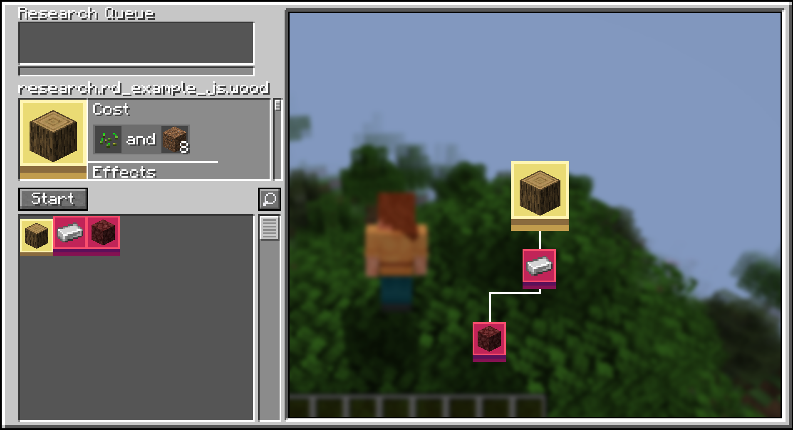

<p align="center"></p>

# Researchd
[](https://www.curseforge.com/minecraft/mc-mods/researchd)
[](https://www.curseforge.com/minecraft/mc-mods/researchd/files)

**This mod implements the Factorio's research system into Minecraft**

**The mod supports both KubeJS and Datapack customization, allowing
pack developers to add their own Researches and Research Packs**



**The KubeJS code for the root research**
```javascript
ResearchdEvents.registerResearches(event => {
    event.create('rd_example_js:wood')
        .icon('minecraft:oak_log')
        .method(ResearchMethodHelper.and(
            ResearchMethodHelper.consumeItem('minecraft:wheat_seeds', 1),
            ResearchMethodHelper.consumeItem('minecraft:dirt', 8)
        ))
        .effect(ResearchEffectHelper.unlockRecipe('minecraft:oak_planks'));
}
```

Without holding a wrench:


When holding a wrench:


## Supported Versions

| NeoForge |        |
|----------|--------|
|          | 1.20.1 |
| Forge    |        |
|          | 1.20.1 |

1.21 coming soon!

## Pre-Supported Mods
* Computer Craft
* Create
* Cyclic
* Elemental Craft
* Embers
* GregTechCEu Modern
* LaserIO
* Mekanism
* Mekanism Extras
* Pipez
* Pneumatic Craft Repressurized
* Powah
* Pretty Pipes
* Pretty Pipes Fluids
* Thermal Series

## Dependencies
None! Cable Facades is a standalone mod

## Mod Authors
Tags are also available for blocks, just add the tag: `#cable_facades:supports_facade`

## Discord
[](https://discord.gg/m4EHeRjfZ9)

Share your configs in our [Discord](https://discord.gg/m4EHeRjfZ9) so that we can expand support !