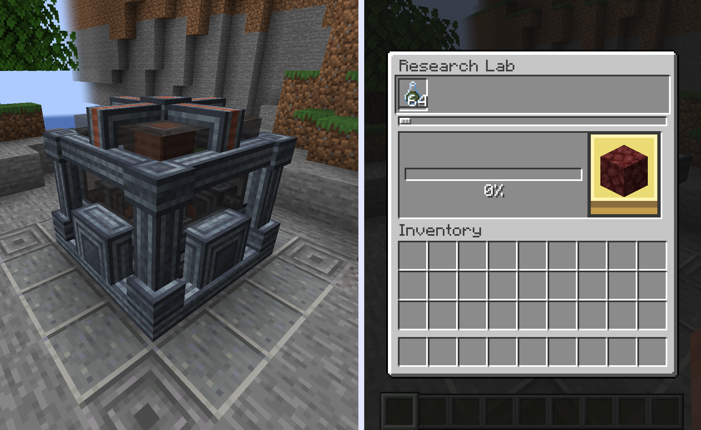

<p align="center"></p>

# Researchd
[](https://www.curseforge.com/minecraft/mc-mods/researchd)
[](https://www.curseforge.com/minecraft/mc-mods/researchd/files)

**This mod implements the Factorio's research system into Minecraft**

**The mod supports both KubeJS and Datapack customization, allowing
pack developers to add their own Researches and Research Packs**

## Content

### Researches


**The KubeJS code for the root research**

```javascript
ResearchdEvents.registerResearches(event => {
    event.create('rd_example_js:wood')
        .icon('minecraft:oak_log')
        .method(ResearchMethodHelper.and(
            ResearchMethodHelper.consumeItem('minecraft:wheat_seeds', 1),
            ResearchMethodHelper.consumeItem('minecraft:dirt', 8)
        ))
        .effect(ResearchEffectHelper.unlockRecipe('minecraft:oak_planks'));
});
```

### Research Packs

**The Research Lab and its GUI**



**The KubeJS code for the research pack**

```javascript
ResearchdEvents.registerResearchPacks(event => {
    event.create('rd_examples_js:test_pack')
        .color(120, 150, 90)
        .sortingValue(0);
});
```

## Supported Versions

| NeoForge | 1.21.1 |
|----------|--------|

## Pack-dev info

For how to get started in pack dev, there are both in-game and online resources:

- The `/rd example kubejs` and `/rd example datapack` commands for generating example datapacks/scripts

- The online wiki at <https://porting-dead-mods.github.io/Researchd/>

# Addon-dev info

For info and help on developing addons visit the online wiki <https://porting-dead-mods.github.io/Researchd/>

## License

This mod is licensed under our license, the 'Common Sense License'.

This means that you can use and modify the code freely **only if you make major changes (>50%) code alteration**.
This assumes that you are using the entire source code. Using small parts of the code is fine.

Regardless of how much you use, make sure to always credit.

If development ends, either through an official announcement,
unreachability of the developers and inactivity on the project
for prolonged amounts of time, all restrictions
except the requirement to provide credit drop.

---

The reason for us not using one of the popular open source licenses like GPL, MIT or Mozilla is due to bad
experiences in the past where we had our projects stolen and reuploaded by rather famous figures in the
modding community.

## Dependencies

Researchd relies on our library mod called Porting Dead Mods

## Discord

Join our [Discord](https://discord.gg/m4EHeRjfZ9) to get help, make suggestions and chat about the mod
